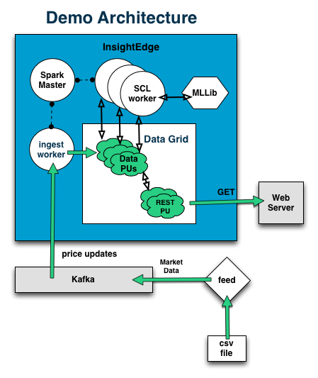

### Practical Financial Engineering with InsightEdge

#This is not a working demo yet

This repository contains working code for an [InsightEdge](http://insightedge.io) application that uses NYSE market data to continuously calculate the [Security Characteristic Line](https://en.wikipedia.org/wiki/Security_characteristic_line) for 41 stocks.



####Requirements

* Java 1.8 (OSX 1.8.0_60-b27 used)
* Kafka 2.11-0.10.2.0
* SBT 0.13.13
* Maven
* InsightEdge 1.0.0 with XAP 12.0.0 (premium used)
* XAP license

####Demo Steps

1. Initial setup
2. Install, Start Kafka 
3. Install, Start InsightEdge
4. Build, Deploy Processing Unit

5. Run Demo Setup Apps

6. Start Kafka Feed
7. Submit Spark Jobs
8. View Results

#####Initial Setup

This demo recipe is semi-automated. You can copy-paste most of the commands directly into terminal assuming you follow this initial setup section. Note that these commands were tested on a Mac.

Create a working directory.
 
```bash
$ export WORKING_DIRECTORY=/full/path/to/your/working/directory/without/trailing/slash
$ mkdir -p ${WORKING_DIRECTORY}
$ cp /path/to/xap-license.txt ${WORKING_DIRECTORY}
```  

#####Install, Start Kafka

Follow [these quickstart instructions](http://kafka.apache.org/quickstart). In this document, we will refer to the unzipped directory as `KAFKA_HOME`. 

Steps 1-2 are sufficient. Steps 3-5 are useful for verifying that the queue is operational...
```bash
# from the kafka install directory...
export KAFKA_HOME=$(pwd)
```

#####Install, Start InsightEdge 

* Download from [http://insightedge.io](http://insightedge.io)
```bash
$ cd ${WORKING_DIRECTORY}
$ unzip ~/Downloads/gigaspaces-insightedge-1.0.0-premium.zip
$ export IE_HOME="${WORKING_DIRECTORY}/gigaspaces-insightedge-1.0.0-premium"
$ export XAP_LOOKUP_GROUPS="xap-12.0.0"
$ export XAP_LOOKUP_LOCATORS="127.0.0.1"
$ mv xap-license.txt ${IE_HOME}/datagrid
$ cd ${IE_HOME}
$ # To start Spark master and worker and XAP data grid with 1 manager and 2 containers
$ ./sbin/insightedge.sh --mode master --master 127.0.0.1
$ ./sbin/insightedge.sh --mode slave --master 127.0.0.1
$ # To install artifacts to your local Maven repository
$ ./sbin/insightedge-maven.sh
$ # To start XAP Management Center
$ datagrid/bin/gs-ui.sh
```
Spark WebUI will be available at http://127.0.0.1:8080

Spark Master connection endpoint will be at spark://127.0.0.1:7077

#####Build, Deploy Processing Unit

```bash

$ cd ${WORKING_DIRECTORY}
$ git clone https://github.com/InsightEdge/financial-engineering
$ cd financial-engineering
$ export FE_SRC_HOME=$(pwd)
$ sbt assembly
$ find . -type f -name "*.jar"

./core/target/scala-2.10/core.jar
./demoSetup/target/scala-2.10/setup.jar
./processingUnit/target/scala-2.10/demoPU.jar
./sparkJobs/target/scala-2.10/sparkjobs.jar
./target/scala-2.10/financial-engineering-assembly-1.0.0.jar
./web/target/scala-2.10/web-assembly-1.0.0.jar

$ cd ${IE_HOME} 
$ export XAP_LOOKUP_LOCATORS="127.0.0.1" ; ./datagrid/bin/gs.sh deploy ${FE_SRC_HOME}/processingUnit/target/scala-2.10/demoPU.jar

```

######Run Demo Setup Apps

```bash
$ cd ${FE_SRC_HOME}
$ java -cp "./demoSetup/target/scala-2.10/setup.jar:${IE_HOME}/datagrid/lib/required/*" org.insightedge.examples.financialengineering.applications.TickerSymbolCustomizer
```

######Start Kafka Feed

```bash
$ cd ${FE_SRC_HOME}
$ java -cp "./sparkJobs/target/scala-2.10/sparkjobs.jar:${IE_HOME}/datagrid/lib/required/*" org.insightedge.examples.financialengineering.applications.Feed <path to stock data dir> 1
```

######Submit Spark Jobs

```bash
$ cd ${IE_HOME} 
$ ./bin/insightedge-submit --class org.insightedge.examples.financialengineering.jobs.MarketTickProcessor --master spark://127.0.0.1:7077 ${FE_SRC_HOME}/sparkJobs/target/scala-2.10/sparkjobs.jar
```

######View Results

Navigate to Space Browser in XAP Management Center to query individual and market returns

## Troubleshooting

If you have any trouble running the demo, please contact us at any of the following:
- Slack channel using [invitation](http://insightedge-slack.herokuapp.com/)
- StackOverflow [insightedge tag](http://stackoverflow.com/questions/tagged/insightedge)
- contact form at [InsightEdge main page](http://insightedge.io/)
- or [email message](mailto:hello@insightedge.io)